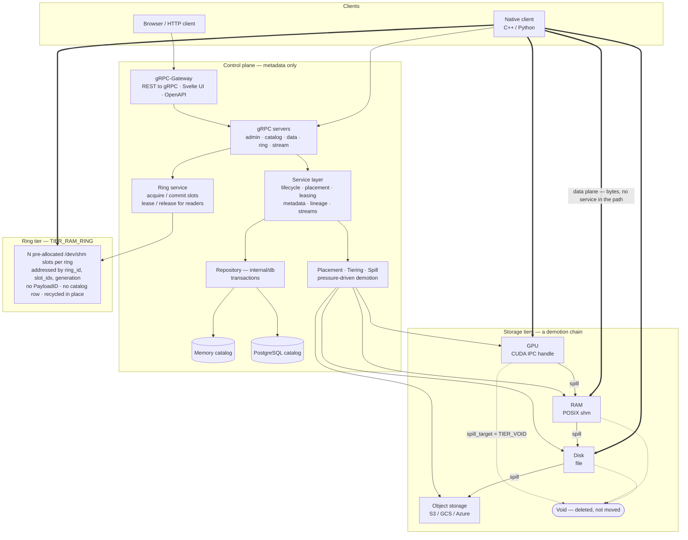

# Payload Manager

[](https://github.com/hurdad/payload-manager/actions/workflows/ci.yml)
[](https://codecov.io/gh/hurdad/payload-manager)

Payload Manager is a high-performance control plane for managing opaque binary payloads across multiple storage tiers (GPU, RAM, disk, object storage, or void) without routing payload bytes through the service itself.

The platform is designed around a strict control-plane/data-plane split:

- **Control plane:** metadata, placement, leases, lineage, lifecycle, and APIs.
- **Data plane:** direct producer/consumer access to memory regions, files, or object references.

## Why Payload Manager

Modern pipelines often spend more time moving bytes through orchestration services than doing useful work. Payload Manager avoids this by returning descriptors and leases so clients can access data directly from the selected tier.

## Core capabilities

- Tier-aware placement across GPU, RAM, disk, object storage, and void (discard-on-eviction).
- A ring tier (`TIER_RAM_RING`) for steady-rate pipelines: pre-allocated shm slots
  addressed by position and rewritten in place, with no catalog row per capture.
- Lease-based read stability for payload access.
- Lifecycle orchestration (`allocate -> commit -> active -> expire/delete`).
- Metadata and lineage tracking.
- Multiple repository backends (memory, PostgreSQL).
- gRPC service interfaces for admin, data, catalog, and stream workflows.

## Architecture at a glance

The thing to notice first: **payload bytes never travel through the service.**
Clients ask for a descriptor and a lease, then read or write the memory, file or
object directly. Everything in the control plane below moves metadata only.



**The demotion chain.** Tiers are not a menu. A payload is placed once, and the
tiering manager spills it downward as the tier holding it comes under pressure:
GPU evictions go to RAM, RAM to disk, disk to object storage. The bytes move;
the `PayloadID` does not. A payload can set `spill_target = TIER_VOID` on its
eviction policy to be deleted instead of demoted, which is how something is
marked ephemeral. See
[Design Details](docs/DESIGN.md#4-placement-tiering-and-spill-behavior).

**The ring tier is beside the catalog, not under it.** Every other tier holds
UUID-addressed payloads the repository tracks through allocate, commit, spill
and delete. Ring slots are pre-allocated at startup from static config and
rotate in place, so they carry no `PayloadID` and no database row — producers
and consumers refer to them by position, and the generation counter is what
tells a slow reader its slot was recycled underneath it. It has no spill
chain: a ring slot is overwritten, never demoted.

For detailed documentation, see:

- [Architecture Overview](docs/ARCHITECTURE.md)
- [Design Details](docs/DESIGN.md)
- [Testing Strategy](docs/TESTING_STRATEGY.md)
- [Metrics Reference](docs/METRICS.md)

## Build

```bash
mkdir -p build
cd build
cmake ..
cmake --build .
```

Optional CMake flags:

- `-DPAYLOAD_MANAGER_ENABLE_OTEL=ON|OFF` — **auto-detected**: on when
  `opentelemetry-cpp-dev` is installed, off when it is not. Pass it explicitly to
  override. Every published image builds with it on, so a machine that has the
  package now builds what ships.
- `-DPAYLOAD_MANAGER_ENABLE_ARROW_CUDA=ON` — off by default; enables the GPU tier
  in the service via Arrow CUDA, and requires `libarrow-cuda-dev`.
- `-DPAYLOAD_MANAGER_ENABLE_JEMALLOC=ON` — off by default; links the service
  against jemalloc. The container images turn this on.
- `-DPAYLOAD_MANAGER_ENABLE_POSTGRES=OFF` — **on** by default. Turn it off to
  build without the PostgreSQL backend, leaving only the in-memory catalog.

Client build switch:

- C++ CUDA-capable client build: `-DPAYLOAD_MANAGER_CLIENT_ENABLE_CUDA=ON`

### Dependencies

Arrow and OpenTelemetry are taken from system packages; this repository has no
git submodules. On Ubuntu 26.04:

```bash
sudo apt install libarrow-dev            # Arrow 23.0.1 from universe
sudo apt install opentelemetry-cpp-dev   # only for -DPAYLOAD_MANAGER_ENABLE_OTEL=ON
```

Ubuntu universe carries no Arrow CUDA build, and releases before 26.04 carry no
usable Arrow or OpenTelemetry at all. For those — and for `libarrow-cuda-dev` —
use the [Apache Arrow apt repository](https://arrow.apache.org/install/), which
is what the container images do (pinned to 25.0.1):

```bash
sudo apt install -y -V ca-certificates lsb-release wget
wget https://apache.jfrog.io/artifactory/arrow/ubuntu/apache-arrow-apt-source-latest-$(lsb_release --codename --short).deb
sudo apt install -y -V ./apache-arrow-apt-source-latest-$(lsb_release --codename --short).deb
sudo apt update
sudo apt install -y -V libarrow-dev libarrow-cuda-dev
```

To build with OpenTelemetry enabled:

```bash
cmake -S . -B build-otel -DPAYLOAD_MANAGER_ENABLE_OTEL=ON
cmake --build build-otel
```

## Run

```bash
./payload-manager --config config.yaml
```

## Docker

All Dockerfiles and Compose manifests now live under [`docker/`](docker/README.md).

### Dockerfiles

| Dockerfile | Published as | Arch | OTEL | GPU |
|---|---|---|---|---|
| `docker/Dockerfile` | `ghcr.io/hurdad/payload-manager` | amd64 + arm64 | On | Off |
| `docker/Dockerfile.cuda` | `ghcr.io/hurdad/payload-manager-cuda` | amd64 | On | On |
| `docker/Dockerfile.payloadctl` | `ghcr.io/hurdad/payload-manager-payloadctl` | amd64 + arm64 | — | — |
| `docker/Dockerfile.gateway` | `ghcr.io/hurdad/payload-manager-gateway` | amd64 + arm64 | — | — |

One tag serves both architectures, so the same pull works on an x86 server and
on a Jetson:

```bash
docker pull ghcr.io/hurdad/payload-manager
```

CUDA is amd64 only, because its only arm64 target would be a Jetson and the GPU
tier cannot work there — CUDA IPC is unsupported on Tegra. Use the ring tier
instead; see [Jetson and other integrated GPUs](#jetson-and-other-integrated-gpus)
below and [Published images and architectures](docker/README.md#published-images-and-architectures).

There is no `-otel` image any more: OpenTelemetry is compiled into every service
image and stays inert until `observability.metrics_enabled` or
`observability.tracing_enabled` is set.

```bash
# Production image (OpenTelemetry compiled in, inert until configured)
docker build -f docker/Dockerfile -t payload-manager:latest .

# GPU + OTEL image
docker build -f docker/Dockerfile.cuda -t payload-manager:cuda .

# payloadctl CLI image
docker build -f docker/Dockerfile.payloadctl -t payloadctl:latest .
```

### Docker Compose

Full compose matrix — pick a feature combination. The OTEL column is whether the
stack *configures* observability, not whether the image supports it: every
service image has OpenTelemetry compiled in, and it stays inert until
`observability.metrics_enabled` or `.tracing_enabled` is set.

Stacks are organised by catalog backend. Observability is an overlay rather
than a stack of its own: OpenTelemetry is compiled into the one service image,
so what used to distinguish a "with OTEL" deployment is only which config it
mounts.

| Compose file | Database | GPU | Host port |
|---|---|---|---|
| `docker/docker-compose.memory.yml` | **memory** — no DB container | Off | 50052 |
| `docker/docker-compose.postgres.yml` | PostgreSQL | Off | 50051 |
| `docker/docker-compose.gpu.postgres.yml` | PostgreSQL | On | 50056 |
| `docker/docker-compose.gateway.yml` | PostgreSQL | Off | 8080 (HTTP) |

| Overlay | Effect |
|---|---|
| `docker/docker-compose.otel.yml` | Swaps in a config with metrics and tracing enabled |
| `docker/docker-compose.observability.yml` | Adds Alloy, Prometheus, Grafana and Tempo to receive it |

```bash
# Memory catalog — one container, no database to run
docker compose -f docker/docker-compose.memory.yml up --build

# PostgreSQL, observability not configured
docker compose -f docker/docker-compose.postgres.yml up --build

# Postgres + OTEL (add observability stack)
docker compose -f docker/docker-compose.postgres.yml -f docker/docker-compose.otel.yml -f docker/docker-compose.observability.yml up --build

# GPU + Postgres. Its config does not enable observability, so the overlay
# below has nothing to receive — use docker-compose.gateway.gpu.yml or the
# minio.gpu stack for a GPU deployment that does.
docker compose -f docker/docker-compose.gpu.postgres.yml up --build
```

The `docker/docker-compose.observability.yml` overlay adds Grafana Alloy (OTLP receiver), Prometheus, Grafana (`:3000`), and Tempo. It should only be layered on OTEL-enabled compose files.

### payloadctl

`payloadctl` supports tiering advisory commands that are useful during placement tuning and spill control:

```bash
# Best-effort hint to stage a payload in a faster tier.
payloadctl <addr> prefetch <uuid> <tier=ram|disk|gpu>

# Best-effort advisory pin. duration_ms=0 means "stay pinned until explicit unpin".
payloadctl <addr> pin <uuid> [duration_ms]

# Removes an active pin (idempotent if the payload is already unpinned).
payloadctl <addr> unpin <uuid>
```

Behavior notes:

- `prefetch` is best-effort and idempotent; it does not guarantee immediate movement.
- `pin` blocks spill while active. Use a finite `duration_ms` for bounded pinning windows.
- `unpin` is safe to call repeatedly and is a no-op when no pin exists.

## Clients (CPU vs CUDA)

C++ client build modes:

```bash
# CPU-focused (default)
cmake -S . -B build
cmake --build build

# CUDA-capable build intent (requires Arrow CUDA artifacts)
cmake -S . -B build-cuda -DPAYLOAD_MANAGER_CLIENT_ENABLE_CUDA=ON
cmake --build build-cuda
```

Python client install modes:

```bash
# CPU-safe base install
pip install ./client/python

# Explicit CUDA-capable install intent
pip install './client/python[cuda]'
```

Current GPU client runtime status:

- C++ client: GPU descriptor runtime handling is implemented when built with `-DPAYLOAD_MANAGER_CLIENT_ENABLE_CUDA=ON` and Arrow CUDA libraries are available.
- Python client: GPU descriptor read/write runtime handling is implemented when installed with CUDA extras and Arrow CUDA dependencies are available.
- Result: Both C++ and Python clients can use GPU descriptors at runtime in CUDA-capable environments.

### Jetson and other integrated GPUs

The GPU tier does **not** work on Jetson. It hands consumers a CUDA IPC handle, and CUDA IPC is
unsupported on Tegra — worse, it fails one-sided, so the producer's `cudaIpcGetMemHandle`
succeeds and only the consumer's `cudaIpcOpenMemHandle` fails. The Jetson images therefore build
with `PAYLOAD_MANAGER_ENABLE_ARROW_CUDA=OFF`.

Use the ring tier instead. A Jetson's GPU is integrated and addressing unified, so host memory is
device memory: the C++ client registers a ring slot's shm mapping with CUDA once and hands back a
device pointer alongside the host one, with no copy and no IPC handle.

```cpp
RingConsumer consumer(&client, RingConsumer::Options{.register_for_gpu = true});
auto lease = consumer.LeaseAndOpen(ref.ring_id(), ref.slot_idx(),
                                   ref.generation(), ref.size_bytes());
LaunchKernel(lease->dev_va, lease->size_bytes);   // same pages as lease->host_va
```

Requires `-DPAYLOAD_MANAGER_CLIENT_ENABLE_CUDA=ON`; without it the flag is ignored and `dev_va`
stays null. Full details, including the L4T `cudaHostRegister` mapping-permission quirk, are in
[GPU access on integrated-GPU hardware](docs/ARCHITECTURE.md#gpu-access-on-integrated-gpu-hardware-jetson).

## Gateway and UI

The `gateway/` directory contains a Go binary that bridges REST/HTTP to the gRPC backend and serves an embedded Svelte web UI.

### Features

- REST API via [gRPC-Gateway](https://github.com/grpc-ecosystem/grpc-gateway) — all gRPC services exposed as JSON over HTTP.
- OpenAPI spec at `gateway/openapi/apidocs.swagger.json`.
- Embedded Svelte UI served at `/` — no separate web server needed.
- Payload download endpoint (`GET /v1/payloads/{id}/download`) — automatically spills RAM/GPU payloads to disk before streaming.

### Quick start (Docker)

```bash
# Start payload-manager + gateway (Postgres, no GPU)
docker compose -f docker/docker-compose.gateway.yml up --build
```

The UI is then available at `http://localhost:8080/`.

### UI overview

| Page | API coverage |
|------|-------------|
| Payloads | List, filter by tier, download, spill, promote, pin/unpin, prefetch, delete, view snapshot/lineage/metadata |
| Streams | Create/delete streams, read entries, append entries, manage consumer group offsets |
| Admin | Per-tier stats (GPU/RAM/Disk/Object) with totals |

### Environment variables

| Variable | Default | Description |
|----------|---------|-------------|
| `GRPC_ADDR` | `localhost:50051` | gRPC backend address |
| `HTTP_ADDR` | `:8080` | HTTP listen address |
| `DISK_ROOT_PATH` | `/var/lib/payload-manager/payloads` | Disk storage root (must match payload-manager config) |

### Regenerate code

```bash
# Go stubs, OpenAPI (per-service + merged), and Python stubs
make generate

# Or one half at a time
scripts/codegen.sh go
scripts/codegen.sh python
```

`scripts/codegen.sh` installs the tools it needs at pinned versions, and takes
the Go toolchain from `gateway/go.mod` rather than whatever is on `PATH` —
generated output is committed and CI fails when regeneration disagrees with the
tree, and the toolchain that compiles `protoc-gen-go-grpc` changes what it
emits. Building the same plugin version under a different Go rewrote comment
formatting across 154 lines once already.

Only `go` and `python3` need to be installed. The Python half additionally
requires the pinned `grpcio-tools` and a configured CMake build, and says so if
either is missing.

## Repository layout

- `cmd/`: executable entrypoints (`payload-manager`, `payloadctl`).
- `internal/`: core runtime, services, storage tiers, DB adapters, lease/tiering/spill logic.
- `proto/`: protobuf definitions — the single root for the public API, node-local
  runtime config, and the vendored googleapis protos.
- `gateway/`: gRPC-Gateway binary and Svelte UI.
- `ui/`: Svelte sources and the Playwright end-to-end suite, embedded into the gateway image.
- `client/`: C++ and Python client surfaces.
- `config/`: sample runtime configuration files.
- `docker/`: Dockerfiles and Compose stacks.
- `observability/`: Grafana, Prometheus, Tempo and Alloy configuration for the local stack.
- `scripts/`: code generation and tooling entry points.
- `cmake/`: shared CMake modules.
- `tests/`: unit and integration coverage.
- `docs/`: architecture, design, and testing documentation.

## License

Apache-2.0
