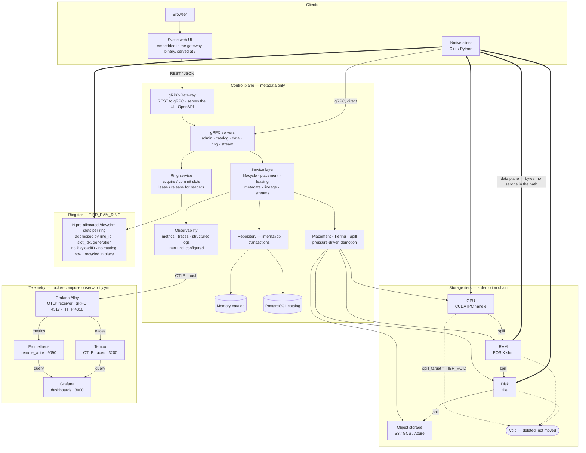

# Payload Manager Architecture Overview

## 1. System purpose

Payload Manager provides a control plane for binary payload lifecycle and placement while keeping payload bytes on their native storage path. It coordinates metadata, placement decisions, and access guarantees (leases) so workers can read/write directly from storage tiers.

## 2. Diagram

The rendered version of this is in the top-level README; this is the source it
was drawn from. GitHub renders the block below directly, so edit here and keep
`docs/architecture.svg` in step by running
`python3 scripts/make_architecture_diagram.py`.



## 3. Major architectural layers

### Gateway (REST + UI)

`gateway/` is a standalone Go binary serving the browser path — HTTP clients and
the web UI. It is not in front of everything: a native C++ or Python client
speaks gRPC to the servers directly and never touches the gateway.

- Translates HTTP/JSON requests to gRPC using [gRPC-Gateway v2](https://github.com/grpc-ecosystem/grpc-gateway).
- Serves a compiled Svelte single-page application embedded directly in the binary via `embed.FS`.
- Exposes a merged OpenAPI 2.0 spec at `gateway/openapi/apidocs.swagger.json`.
- Provides a `GET /v1/payloads/{id}/download` endpoint that spills RAM/GPU payloads to disk on demand and streams the file bytes back to the client.
- HTTP annotations (`google.api.http`) are defined inline in the proto files under `proto/payload/manager/services/v1/`.
- Generated Go stubs live in `gateway/gen/go/`; regenerate with `make generate` (requires `buf` and local `protoc-gen-*` plugins).

The gateway is stateless and can be restarted independently of the payload-manager. It requires read-only access to the disk payload storage path (`DISK_ROOT_PATH`) to serve downloads.

### API and runtime boundary

- **Entrypoints:** `cmd/payload-manager`, `cmd/payloadctl`.
- **Runtime:** server bootstrap and process wiring in `internal/runtime`.
- **Transport:** gRPC services under `internal/grpc` implementing API contracts from `proto/payload/manager/services/v1`.

### Service layer

Core domain services live in `internal/service`:

- `data_service`: payload lifecycle operations and descriptor/lease-facing flows.
- `catalog_service`: metadata/catalog retrieval plus tiering advisories (`Prefetch`, `Pin`, `Unpin`).
- `admin_service`: administrative and operational actions.
- `stream_service`: stream-oriented APIs and consumer offset behavior.
- `ring_service`: `TIER_RAM_RING` slot reservation and read leases (`AcquireRingSlot`,
  `CommitRingSlot`, `MapRing`, `LeaseRingSlot`, `ReleaseRingSlot`).

These services operate on domain abstractions and call into core managers and repository interfaces.
`ring_service` is the exception: it talks to `internal/ring` and never to the repository, because ring
slots carry no catalog state.

### Core orchestration layer

Key responsibilities live in `internal/core`, `internal/lease`, `internal/tiering`, `internal/spill`, and `internal/metadata`:

- Payload state transitions and commit semantics.
- Placement and re-placement decisions.
- Lease issuance, tracking, and release.
- Spill scheduling and worker execution.
- TTL-based expiration via background worker.
- Metadata caching and lookup helpers.

### Persistence abstraction

`internal/db/api` defines backend-agnostic repository + transaction contracts.

Implementations:

- `internal/db/memory`: in-process testing backend.
- `internal/db/postgres`: multi-node catalog backend.

The Postgres schema is created and upgraded by `db::postgres::BootstrapSchema`
(`internal/db/postgres/pg_schema.hpp`), called once at startup by
`factory::BuildRepository` and again by the repository parity test, so there is
exactly one description of the schema. Every statement is idempotent —
`CREATE ... IF NOT EXISTS`, `ADD COLUMN IF NOT EXISTS`, guarded `DO $$` blocks
for renames and type changes — so it is safe to replay against a fresh database
or one created by an older build.

There is no migration runner. A versioned one becomes worth building at the
first change idempotent DDL cannot express — a dropped column, a split table, a
data backfill, anything order-dependent. Until then a second, ordered
description of the schema would only be something to keep in step.

### Storage tier abstraction

`internal/storage` provides tier implementations and factory wiring:

- RAM store (`internal/storage/ram`)
- GPU store (`internal/storage/gpu`)
- Disk store (`internal/storage/disk`)
- Object store (`internal/storage/object`)

A common interface allows placement/tiering logic to stay backend-agnostic.

`TIER_VOID` is a sentinel value — not a storage backend. When a payload is spilled to void the tiering layer deletes it rather than moving bytes. See [Design Details](./DESIGN.md#tier_void-discard-on-eviction).

### Ring tier (`TIER_RAM_RING`)

`internal/ring` is deliberately not one of the stores above. The tiers listed there hold
UUID-addressed payloads that the repository tracks through allocate, commit, spill and delete.
A ring holds N POSIX shm slots, pre-allocated at startup from static config
(`RuntimeConfig.storage.ring`) and rotated in place, with no `PayloadID` and no catalog row.

Slots are position-addressed by `(ring_id, slot_idx, generation)`:

- A producer calls `AcquireRingSlot`, writes into the slot's `/dev/shm` region through its own
  mmap, and calls `CommitRingSlot`. PM never copies the bytes.
- A consumer calls `MapRing` once at startup to learn every slot's shm name, then per capture
  takes a read lease on the `(slot_idx, generation)` carried in the upstream event, reads through
  its cached pointer, and releases.
- The generation counter is what makes recycling safe: a consumer that falls behind gets
  `FAILED_PRECONDITION` at lease time rather than reading bytes the producer has overwritten.

Neither reservation clears on its own — an uncommitted slot stays `WRITING` and a held lease keeps
the slot's refcount above zero — so an exhausted ring reclaims both lazily, taking back slots held
past `slot_write_timeout_ms` and leases held past `lease_ttl_ms`. Both are crash safety nets sized
well above the honest worst case; reclaiming from a process that is merely slow lets a producer
overwrite bytes a consumer is still reading.

Per-ring slot accounting is reported by the admin `Stats` RPC (`StatsResponse.rings`) and by the
`payload.ring.*` gauges. See [Metrics](./METRICS.md).

#### GPU access on integrated-GPU hardware (Jetson)

On a discrete GPU the GPU tier hands a consumer a CUDA IPC handle and the consumer maps device
memory directly. That mechanism does not exist on Tegra. CUDA IPC is unsupported there, and it
fails one-sided, which is the part worth knowing: the producing side succeeds and only the
consumer fails. Measured on an Orin (sm_87, `integrated=1`, JetPack 6 / CUDA 12.2.12), two
processes:

```
producer: cudaIpcGetMemHandle  -> cudaSuccess
consumer: cudaIpcOpenMemHandle -> cudaErrorInvalidValue ("invalid argument")
```

So `CudaArrowStore::ExportIPC` returns a handle and the server looks healthy, while the consumer
fails inside `arrow::cuda::CudaIpcMemHandle::FromBuffer` with an error that points nowhere near
the cause. The GPU tier is therefore not usable on Jetson and the Jetson images build with
`PAYLOAD_MANAGER_ENABLE_ARROW_CUDA=OFF`.

The ring tier replaces it, and on this hardware it is arguably the better mechanism rather than a
consolation. A Jetson's GPU is integrated and its addressing unified, so host memory *is* device
memory — there is nothing to copy and no handle to pass. A ring slot is a POSIX shm segment the
consumer already mmaps; registering that mapping with CUDA yields a device pointer to the same
physical pages the producer wrote.

The C++ client does this already — `examples/cpp/ring_example.cpp` is a runnable
walkthrough of the whole cycle. Set `register_for_gpu` on the consumer and read `dev_va` from
the lease:

```cpp
RingConsumer consumer(&client, RingConsumer::Options{
    .register_for_gpu = true,       // cudaHostRegister + cudaHostGetDevicePointer, once per slot
    .log_prefix       = "spectral ring",
});

auto lease = consumer.LeaseAndOpen(ref.ring_id(), ref.slot_idx(),
                                   ref.generation(), ref.size_bytes());
if (!lease) return;                 // stale generation — the slot was recycled

LaunchKernel(lease->dev_va, lease->size_bytes);   // device pointer, zero copy
// lease->host_va is the same bytes from the CPU side
```

Details that matter:

- `register_for_gpu` requires the client to be built with `-DPAYLOAD_MANAGER_CLIENT_ENABLE_CUDA=ON`.
  Without it the flag is ignored entirely, no CUDA symbol is referenced, and `dev_va` stays null.
- Registration happens **once per slot**, when the ring is first mapped — not per lease. The
  per-capture cost is the lease RPC, not a CUDA call.
- A CUDA-enabled consumer maps slots `PROT_READ|PROT_WRITE` even though it only reads, because
  L4T R36's `cudaHostRegister` rejects a read-only mapping with `invalid argument`. Read-only
  discipline then comes from the consumer, not from the kernel. A non-CUDA build keeps the
  enforced read-only mapping.
- The generation check still applies: a consumer that falls behind gets no lease rather than a
  device pointer to bytes the producer has overwritten.

This path is not Jetson-specific — it works anywhere — but on a discrete GPU it crosses PCIe and
the GPU tier is the better choice. On integrated hardware it is the only one that works.

## 4. Cross-cutting concerns

- **Configuration:** protobuf-backed config loading in `internal/config`.
- **Observability:** tracing and metrics in `internal/observability`.
- **Utility primitives:** time and UUID helpers in `internal/util`.
- **Lineage:** graph model and traversal in `internal/lineage`.

## 5. Control flow (high-level)

### gRPC path (native clients)

1. Client calls gRPC API.
2. gRPC server validates and maps request to service layer.
3. Service executes lifecycle/placement/lease logic via core modules.
4. Service persists and reads state via repository interface.
5. Service returns descriptor + lease metadata to caller.
6. Caller accesses payload bytes directly from resolved storage tier.

### HTTP/REST path (gateway)

1. Browser or HTTP client sends JSON request to the gateway.
2. Gateway translates to gRPC and forwards to the payload-manager.
3. Response is translated back to JSON and returned.
4. For `GET /v1/payloads/{id}/download`: gateway resolves the current tier via `ResolveSnapshot`; if the payload is in RAM or GPU it calls `Spill` (blocking) to move it to disk, then acquires a disk read lease and streams the file contents directly from the shared data volume.

## 6. Deployment security considerations

### Configuration file permissions

The runtime configuration file (YAML) contains sensitive values including database connection URIs and object storage credentials. Restrict access so only the service account running `payload-manager` can read it:

```sh
chmod 600 /etc/payload-manager/runtime.yaml
chown payload-manager:payload-manager /etc/payload-manager/runtime.yaml
```

### Secrets and credentials

- **Database passwords** are embedded in `database.postgres.connection_uri`. Prefer a secrets manager (e.g. Vault, AWS Secrets Manager) and inject the URI via the `PAYLOAD_MANAGER_CONFIG` environment variable or a runtime-mounted file rather than baking credentials into static config files.
- **Object storage credentials** (`filesystem_options.s3.*`) should use IAM instance roles or workload identity where available; avoid long-lived static keys in config files.
- **Secret rotation** requires a service restart to pick up a new connection URI unless an external secret manager with dynamic injection is used.

### Network exposure

The gRPC server (`server.bind_address`) defaults to `0.0.0.0:50051`. In production:

- Bind to a loopback or internal address when the service is only accessed within the same node or cluster.
- Place a TLS-terminating proxy (e.g. Envoy) in front of `payload-manager` for external-facing deployments; the server currently uses insecure credentials and relies on the surrounding infrastructure for transport security.
- There is no authentication or authorization of any kind: anyone who can reach the port can allocate, read, spill and delete any payload. The proxy above is what supplies caller identity, not the service.
- The HTTP gateway sends no CORS headers unless `-cors-origins` (`CORS_ORIGINS`) names the origins that need them. The embedded UI and the vite dev proxy are both same-origin, so the default suits both. Enabling it — and especially setting it to `*` — lets any page in an operator's browser reach every `payload-manager` that browser can route to, which is a materially wider door than network reachability alone.

### Shared memory is inside the trust boundary

The RAM tier and the ring tier back payloads with POSIX shared-memory segments created mode `0666` (`internal/storage/ram/ram_arrow_store.cpp`, `internal/ring/ring.cpp`). That is the mechanism the zero-copy data plane depends on — producers and consumers map the segments directly, which is why payload bytes never pass through the service — and it is also the strongest assumption the deployment model makes:

- Any local user, and any container sharing the host's `/dev/shm`, can read every payload resident in the RAM or ring tiers.
- The same parties can write to those segments, undetected. The ring's generation counter guards a consumer against reading a slot the *producer* has recycled; it does not guard against a hostile writer.

So do not co-locate untrusted workloads on the host or in containers sharing its IPC namespace. Restricting the segments further is not a configuration option, because a mode that excluded other users would exclude the clients as well; what bounds the exposure is which users have accounts on the box. `SECURITY.md` carries the same statement for readers arriving from the repository root.

## 7. Non-goals (explicit)

- Payload Manager is not intended to proxy large payload byte streams through gRPC.
- Payload Manager is not intended to collapse all storage tiers into a single physical medium.
- Payload Manager is not intended to hide durability/latency tradeoffs; policy controls are expected.
